#  Binome : BOUKARI Yacine / LEMEILLEUR Paul

## Jeu de données : pré-traitement

```python
import pandas as pd
features = pd.read_csv("data/alt_acsincome_ca_features_85.csv")
features.head()
```

<div>
<table border="1" class="dataframe">
  <thead>
    <tr style="text-align: right;">
      <th></th>
      <th>AGEP</th>
      <th>COW</th>
      <th>SCHL</th>
      <th>MAR</th>
      <th>OCCP</th>
      <th>POBP</th>
      <th>RELP</th>
      <th>WKHP</th>
      <th>SEX</th>
      <th>RAC1P</th>
    </tr>
  </thead>
  <tbody>
    <tr>
      <th>0</th>
      <td>41.0</td>
      <td>4.0</td>
      <td>24.0</td>
      <td>1.0</td>
      <td>2555.0</td>
      <td>6.0</td>
      <td>1.0</td>
      <td>60.0</td>
      <td>2.0</td>
      <td>1.0</td>
    </tr>
    <tr>
      <th>1</th>
      <td>77.0</td>
      <td>7.0</td>
      <td>22.0</td>
      <td>1.0</td>
      <td>4920.0</td>
      <td>39.0</td>
      <td>0.0</td>
      <td>35.0</td>
      <td>1.0</td>
      <td>1.0</td>
    </tr>
    <tr>
      <th>2</th>
      <td>38.0</td>
      <td>1.0</td>
      <td>18.0</td>
      <td>1.0</td>
      <td>440.0</td>
      <td>6.0</td>
      <td>1.0</td>
      <td>50.0</td>
      <td>1.0</td>
      <td>1.0</td>
    </tr>
    <tr>
      <th>3</th>
      <td>30.0</td>
      <td>1.0</td>
      <td>22.0</td>
      <td>5.0</td>
      <td>1555.0</td>
      <td>6.0</td>
      <td>2.0</td>
      <td>80.0</td>
      <td>1.0</td>
      <td>6.0</td>
    </tr>
    <tr>
      <th>4</th>
      <td>36.0</td>
      <td>1.0</td>
      <td>16.0</td>
      <td>1.0</td>
      <td>4030.0</td>
      <td>314.0</td>
      <td>1.0</td>
      <td>70.0</td>
      <td>2.0</td>
      <td>1.0</td>
    </tr>
  </tbody>
</table>
</div>

```python
labels = pd.read_csv("data/alt_acsincome_ca_labels_85.csv")
labels.head()
```

<div>
<table border="1" class="dataframe">
  <thead>
    <tr style="text-align: right;">
      <th></th>
      <th>PINCP</th>
    </tr>
  </thead>
  <tbody>
    <tr>
      <th>0</th>
      <td>True</td>
    </tr>
    <tr>
      <th>1</th>
      <td>True</td>
    </tr>
    <tr>
      <th>2</th>
      <td>False</td>
    </tr>
    <tr>
      <th>3</th>
      <td>True</td>
    </tr>
    <tr>
      <th>4</th>
      <td>False</td>
    </tr>
  </tbody>
</table>
</div>


* AGEP: Age
* COW: Class of worker
* SCHL: Educational attainment
* MAR: Marital status
* OCCP: Occupation
* POBP: Place of Birth
* RELP: Relationship
* WKHP: Hours worked per week past 12 months
* SEX: Sex
* RAC1P: Recoded detailed race code
* PINCP: Total person's income

    
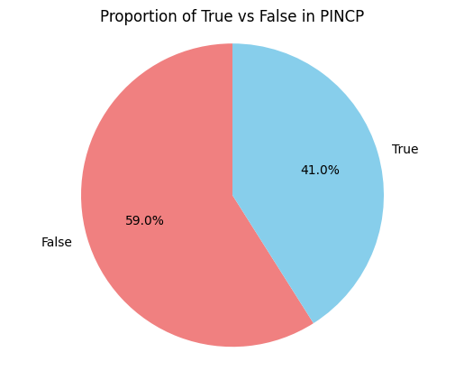
    

<br/>

```python
import seaborn as sns

subfeatures_of_trues = subdataset_of_trues.drop(columns=["PINCP"])
num_cols = len(subfeatures_of_trues.columns)
nrows = num_cols // 2 + num_cols % 2
ncols = 2

fig, axes = plt.subplots(nrows, ncols, figsize=(16, 18))
axes = axes.flatten()

for i in range(num_cols):
    sns.kdeplot(subfeatures_of_trues.iloc[:, i], ax=axes[i], shade=True)
    axes[i].set_title(subfeatures_of_trues.columns[i])

for j in range(num_cols, len(axes)):
    fig.delaxes(axes[j])

plt.tight_layout()
plt.show()
```

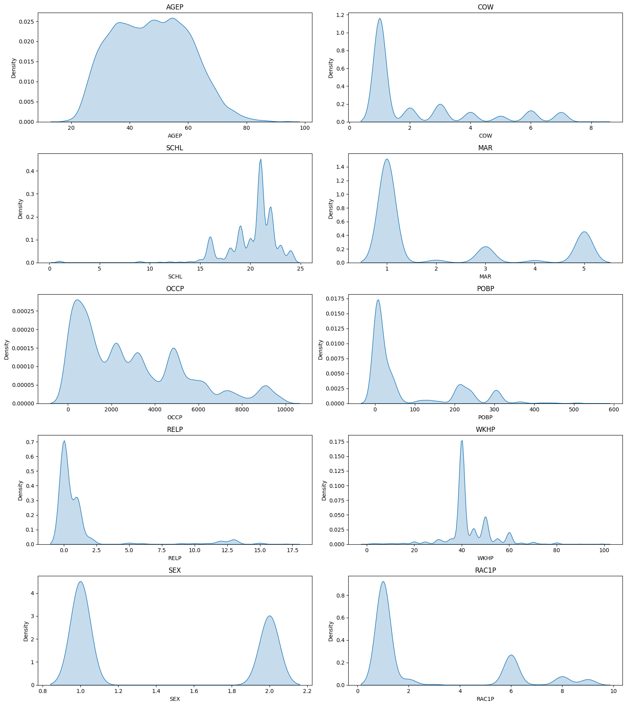

```python
plt.matshow(features.corr())
plt.xticks(range(features.select_dtypes(['number']).shape[1]), features.select_dtypes(['number']).columns, fontsize=14, rotation=45)
plt.yticks(range(features.select_dtypes(['number']).shape[1]), features.select_dtypes(['number']).columns, fontsize=14)
cb = plt.colorbar()
cb.ax.tick_params(labelsize=8)
plt.show()
```


    
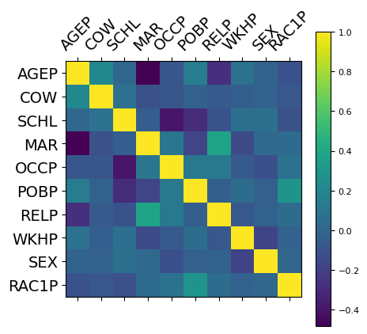
    


```python
from sklearn.preprocessing import OneHotEncoder

columns_to_encode = ["COW", "SCHL", "MAR", "OCCP", "POBP", "RELP", "SEX", "RAC1P"]

encoder = OneHotEncoder(sparse_output=False, handle_unknown="ignore")
features_to_encode = features[columns_to_encode]

encoded_features_array = encoder.fit_transform(features_to_encode)
encoded_features_columns = encoder.get_feature_names_out(columns_to_encode)
encoded_features = pd.DataFrame(encoded_features_array, columns=encoded_features_columns, index=features.index)

features_remaining = features.drop(columns=columns_to_encode)
features_encoded = pd.concat([features_remaining, encoded_features], axis=1)
features_encoded.head()
```


<div>
<table border="1" class="dataframe">
  <thead>
    <tr style="text-align: right;">
      <th></th>
      <th>AGEP</th>
      <th>WKHP</th>
      <th>COW_1.0</th>
      <th>COW_2.0</th>
      <th>...</th>
      <th>SEX_2.0</th>
      <th>RAC1P_7.0</th>
      <th>RAC1P_8.0</th>
      <th>RAC1P_9.0</th>
    </tr>
  </thead>
  <tbody>
    <tr>
      <th>0</th>
      <td>41.0</td>
      <td>60.0</td>
      <td>0.0</td>
      <td>0.0</td>
      <td>...</td>
      <td>1.0</td>
      <td>0.0</td>
      <td>0.0</td>
      <td>0.0</td>
    </tr>
    <tr>
      <th>1</th>
      <td>77.0</td>
      <td>35.0</td>
      <td>0.0</td>
      <td>0.0</td>
      <td>...</td>
      <td>0.0</td>
      <td>0.0</td>
      <td>0.0</td>
      <td>0.0</td>
    </tr>
    <tr>
      <th>2</th>
      <td>38.0</td>
      <td>50.0</td>
      <td>1.0</td>
      <td>0.0</td>
      <td>...</td>
      <td>0.0</td>
      <td>0.0</td>
      <td>0.0</td>
      <td>0.0</td>
    </tr>
    <tr>
      <th>3</th>
      <td>30.0</td>
      <td>80.0</td>
      <td>1.0</td>
      <td>0.0</td>
      <td>...</td>
      <td>0.0</td>
      <td>0.0</td>
      <td>0.0</td>
      <td>0.0</td>
    </tr>
    <tr>
      <th>4</th>
      <td>36.0</td>
      <td>70.0</td>
      <td>1.0</td>
      <td>0.0</td>
      <td>...</td>
      <td>1.0</td>
      <td>0.0</td>
      <td>0.0</td>
      <td>0.0</td>
    </tr>
  </tbody>
</table>
<p>5 rows × 816 columns</p>
</div>

<br/>

```python
from sklearn.model_selection import train_test_split

features_train, features_test, labels_train, labels_test = train_test_split(features_encoded, labels, test_size=0.3, train_size=0.7)
print(features_train.shape)
print(features_test.shape)
print(labels_train.shape)
print(labels_test.shape)
```

    (116420, 816)
    (49895, 816)
    (116420, 1)
    (49895, 1)


## Expérimentation 1 : Comparaison de modèles par défaut

* Jeux de données utilisé (816 colonnes) : 

| Expérimentation 1     | Train   | Test   |
|-----------------------|---------|--------|
| Taille Jeu de Données | 116420  | 49895  |


| Résultats en entraînement <br/> (hyper-param par défaut) | Random Forest   | AdaBoost   | XGBoost |
|----------------------------------------------------------|-----------------|------------|---------|
| accuracy                                                 |       0.998     |     0.779  |  0.803  |
| temps de calcul (sec.)                                   |       47.4      |     16.2   |   58.9  |
| matrice de confusion                                     |       [68543&nbsp;&nbsp;&nbsp;&nbsp;&nbsp;109]<br/>[90&nbsp;&nbsp;&nbsp;&nbsp;&nbsp;&nbsp;&nbsp;47678]          |   [57064&nbsp;&nbsp;11588]<br/>[14189&nbsp;&nbsp;33579]         |   [58161&nbsp;&nbsp;10491]<br/>[12446&nbsp;&nbsp;35322]      |

<hr />

| Résultats en test <br/> (hyper-param par défaut) | Random Forest   | AdaBoost   | XGBoost |
|--------------------------------------------------|-----------------|------------|---------|
| accuracy                                         |     0.811       |    0.778   |   0.801 |
| matrice de confusion                             |     [25159&nbsp;&nbsp;4301]<br/>[5152&nbsp;&nbsp;15283]            |  [24469&nbsp;&nbsp;4991]<br/>[6070&nbsp;&nbsp;14365]          |   [24943&nbsp;&nbsp;4517]<br/>[5395&nbsp;&nbsp;15040]      |


* Commentaires et Analyse : 

En analysant les résultats, on remarque que les modèles par défaut sont relativement bon sur les données d'entrainement. On constate notamment que Random Forest a une précision de 99,8%. Cependant, lorsqu'on regarde les scores sur les données de test, les resultats sont moins bon. On a donc l'impression que les modèles par défaut ont tendance à faire de l'overfitting.

<br/>

<br/>

<br/>

## Expérimentation 2 : Comparaison Modèles ML par défaut

* Jeux de données utilisé (816 colonnes): 

| Expérimentation 2     | Train   | Test   |
|-----------------------|---------|--------|
| Taille Jeu de Données | 116420  | 49895  |


### 1. Liste des hyperparamètres

#### a) Random Forest

- **n_estimators**: 100, 300, 500
- **max_depth**: None, 10, 20
- **min_samples_split**: 2, 5
- **max_features**: sqrt, log2

#### b) AdaBoost

- **n_estimators**: 50, 100, 200
- **learning_rate**: 0.5, 1.0
- **estimator.max_depth**: 1, 2

#### c) XGBoost

- **n_estimators**: 200, 500
- **max_depth**: 3, 6
- **learning_rate**: 0.05, 0.1
- **sub_sample**: 0.8, 1.0
- **loss**: log_loss, exponential

#### Nombre de plis dans la validation croisée

On garde la valeur par défaut de Scikit-Learn: **5 plis**

#### Estimation du nombre d'entraînements

Nombre d'entraînements par pli:

* **Random Forest**: 3 * 3 * 2 * 2 = **36**
* **AdaBoost**: 3 * 2 * 2 = **12**
* **XGBoost**: 2 * 2 * 2 * 2 * 2 = **32**

Vu qu'il y a 5 plis, le nombre total d'entraînements sera donc: 5 * 36 + 5 * 12 * 5 * 32 = **400 entraînements**

### 2. Résultats

|                               | Train Accuracy | CPU Time | Test Accuracy  | Hyperparamètres  |
|-------------------------------|----------------|----------|----------------|------------------|
| Random Forest (par défaut)    | 0.998          | 47.4s    | 0.811          | defaults sklearn |
| Random Forest (optimisé)      | 0.819          | 30min    | 0.818          | max_depth: None<br/>max_features: "log2"<br/> min_samples_split: 5<br/> n_estimators: 300              |


|                           | Train Accuracy | CPU Time | Test Accuracy  | Hyperparamètres  |
|---------------------------|----------------|----------|----------------|------------------|
| AdaBoost (par défaut)     | 0.779          | 16.2     | 0.778          | defaults sklearn |
| AdaBoost (optimisé)       | 0.804          | 20min    | 0.805          | estimator: DecisionTreeClassifier(max_depth=3)<br/> learning_rate: 1.0<br/> n_estimators: 200             |


|                           | Train Accuracy | CPU Time | Test Accuracy  | Hyperparamètres  |
|---------------------------|----------------|----------|----------------|------------------|
| XGBoost (par défaut)      | 0.803          | 58.9     | 0.801          | defaults         |
| XGBoost (optimisé)        | 0.825          | 34min    | 0.823          | learning_rate: 0.1<br/> loss: "exponential"<br/> max_depth: 6<br/> n_estimators: 500<br/> subsample: 0.8              |

* Commentaires et Analyse : 

On regardant les résultats, on remarque en premier que les modèles optimisés sont plus performant que ceux par défaut (ce qui est attendu) à l'exception du Random Forest qui est moins bon à l'entraînement que sa version par défaut. En globalité, les précisions à l'entraînement et au test sont très proches, témoignant la réduction de l'overfitting. 

## Expérimentation 3 : Comparaison des "meilleurs modèles"

| Résultats en entraînement <br/> (hyper-param optimisés)  | Random Forest   | AdaBoost   | XGBoost |
|----------------------------------------------------------|-----------------|------------|---------|
| accuracy                                                 |       0.819     |     0.804  |  0.825  |
| temps de calcul (sec.)                                   |       10s       |     20s    |   13s   |

| Résultats en test <br/> (hyper-param optimisés)  | Random Forest   | AdaBoost   | XGBoost |
|--------------------------------------------------|-----------------|------------|---------|
| accuracy                                         |     0.818       |    0.805   |   0.823 |
| matrice de confusion                             |     [25284&nbsp;&nbsp;3992]<br/>[5080&nbsp;&nbsp;15539]            |  [24535&nbsp;&nbsp;4741]<br/>[4970&nbsp;&nbsp;15649]          |   [25080&nbsp;&nbsp;4321]<br/>[4495&nbsp;&nbsp;15999]      |

* Commentaires et Analyse : 

Que ce soit en entraînement ou en test, la hiérarchie des modèles en terme de précision est la même. Les modèles du moins bon au meilleur sont ainsi : AdaBoost, Random Forest puis XGBoost. En terme de temps de calcul moyen, AdaBoost est cette fois ci le plus long alors que Random Forest est le plus rapide. Si l'on veut choisir un modèle ayant le meilleur compromis entre temps de calcul et précision, il faudrait donc se tourner vers XGBoost.

## Expérimentation 4 : inférence sur un autre jeu de données


```python
from xgboost import XGBClassifier

def get_best_random_forest():
    return RandomForestClassifier(
        max_depth=None, 
        max_features="log2", 
        min_samples_split=5, 
        n_estimators=300, 
        n_jobs=-1
    )

def get_best_ada_boost():
    return AdaBoostClassifier(
        estimator=DecisionTreeClassifier(max_depth=3), 
        learning_rate=1.0, 
        n_estimators=200
    )

def get_best_xg_boost():
    return XGBClassifier(
        learning_rate=0.1, 
        loss="exponential", 
        max_depth=6, 
        n_estimators=500, 
        subsample=0.8, 
        tree_method="hist", 
        device="cuda", 
        n_jobs=1
    )

def get_best_models():
    return {
        "RandomForest": get_best_random_forest(),
        "AdaBoost": get_best_ada_boost(),
        "XGBoost": get_best_xg_boost(),
    }
```


```python
models_dict = get_best_models()

for model_name, model in models_dict.items():
    print(f"Fitting {model_name} on State CA")
    model.fit(features_train, labels_train)

for state in ["co", "ne"]:
    print(f"Encoding dataset for State {state.upper()} ==============================================================")
    
    state_features = pd.read_csv(f"data/acsincome_{state}_allfeatures.csv")
    print(state_features.head())
    
    state_labels = pd.read_csv(f"data/acsincome_{state}_label.csv")
    print(state_labels.head())

    encoder = OneHotEncoder(sparse_output=False, handle_unknown="ignore")
    state_features_to_encode = state_features[columns_to_encode]

    encoded_state_features_array = encoder.fit_transform(state_features_to_encode)
    encoded_state_features_columns = encoder.get_feature_names_out(columns_to_encode)
    encoded_state_features = pd.DataFrame(encoded_state_features_array, columns=encoded_state_features_columns, index=state_features.index)
    
    state_features_remaining = state_features.drop(columns=columns_to_encode)
    state_features_encoded = pd.concat([state_features_remaining, encoded_state_features], axis=1)
 
    # Add missing columns with value 0
    state_features_encoded = state_features_encoded.reindex(
        columns=features_encoded.columns,
        fill_value=0.0
    )
    
    print(state_features_encoded.head())

    for model_name, model in models_dict.items():
        print(f"Predicting with {model_name} on State {state.upper()}")
        
        state_prediction = model.predict(state_features_encoded)
        state_accuracy = accuracy_score(state_labels, state_prediction)
        state_confusion_matrix = confusion_matrix(state_labels, state_prediction)
    
        print("Accuracy:", state_accuracy)
        print("Confusion Matrix:\n", state_confusion_matrix)
    
        print("~~~~~~~~~~~~~~~~~~~~~~~~~~~~~~~~~~~~~~~~")
```

* Résultats : 

Les résultats obtenus sur les états de Nevada et Colorado se situent entre 0,73 et 0,79 d'accuracy : 

|  Etat / Accuracy            | Random Forest   | AdaBoost   | XGBoost |
|-----------------------------|-----------------|------------|---------|
| Californie (entraînement)   |       0.818     |     0.805  |  0.823  |
| Colorado                    |       0.782     |     0.768  |  0.787  |
| Nevada                      |       0.751     |     0.728  |  0.748  |

* Commentaires et Analyse : 

Ceci est certainement dû au fait qu'en fonction des états, les niveaux de vie diffèrent, de même que les paramètres qui influent sur eux. Un modèle entrainé sur un état X peut donc ne pas performer sur un état Y.

## Expérimentation 5 : impact de la taille du jeu de données


```python
models_dict_2 = get_best_models()
train_sizes = [0.8, 0.7, 0.6, 0.5, 0.4, 0.3, 0.2]
results = {
    model_name: {
        "train_accuracy": [],
        "test_accuracy": [],
        "fit_time": [],
        "confusion_matrix": [],
    }
    for model_name in models_dict_2
}

for train_size in train_sizes:
    print(f"Results for train_size={train_size} ==============================")
    
    features_train, features_test, labels_train, labels_test = train_test_split(
        features_encoded, 
        labels, 
        test_size=1-train_size, 
        train_size=train_size
    )
    
    for model_name, model in models_dict_2.items():
        print(f"Processing: {model_name}")
        
        cross_validation_result = cross_validate(
            model, 
            features_train, 
            labels_train, 
            n_jobs=-1 if "AdaBoost" in model_name else 1
        )
        results[model_name]["fit_time"].append(np.mean(cross_validation_result["fit_time"]))
        print(f'Cross-validation Fit Times: {results[model_name]["fit_time"][-1]}')
        
        model.fit(features_train, labels_train)
        
        train_prediction = model.predict(features_train)
        
        train_accuracy = accuracy_score(labels_train, train_prediction)
        results[model_name]["train_accuracy"].append(train_accuracy)
        print(f'Training Accuracy: {results[model_name]["train_accuracy"][-1]}')

        test_prediction = model.predict(features_test)
        
        test_accuracy = accuracy_score(labels_test, test_prediction)
        results[model_name]["test_accuracy"].append(test_accuracy)
        print(f'Test Accuracy: {results[model_name]["test_accuracy"][-1]}')
        
        test_confusion_matrix = confusion_matrix(labels_test, test_prediction)
        
        test_confusion_matrix_norm = test_confusion_matrix / test_confusion_matrix.sum(axis=1, keepdims=True)
        results[model_name]["confusion_matrix"].append(test_confusion_matrix_norm)
        print(f'Test Confusion Matrix:\n{results[model_name]["confusion_matrix"][-1]}')
    
        print("~~~~~~~~~~~~~~~~~~~~~~~~~~~~~~~~~~~~~~~~")
```


## Modèle choisi pour la suite : 

Pour la suite, nous choisissons le modèle XGBoost. Il présente une meilleure accuracy et un temps de calcul moindre comparé aux deux autres.

```python
model = get_best_xg_boost()
model.fit(features_train, labels_train)
```

## Explicabilité : "permutation feature importance"


```python
from sklearn.inspection import permutation_importance

reduced_sample_size = min(2000, len(features_test))
reduced_sample_indices = np.random.choice(features_test.index, reduced_sample_size, replace=False)

features_reduced = features_test.loc[reduced_sample_indices]
labels_reduced = labels_test.loc[reduced_sample_indices]

result = permutation_importance(
    model,
    features_reduced,
    labels_reduced,
    n_repeats=5,
    random_state=42,
    n_jobs=1
)
```

* Résultats obtenus : 
    
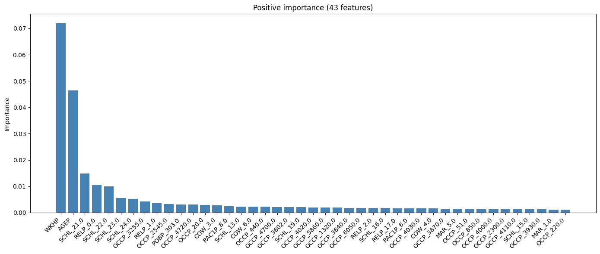
    
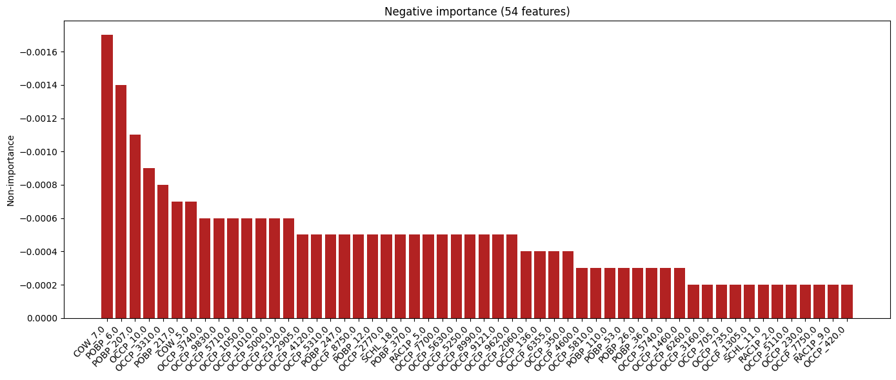

* Analyses :

Ces 2 graphiques nous permettent d'identifier 2 éléments : les features les plus importantes et les moins importantes. En d'autre terme, celles ayant le plus gros impact sur la prédiction et celles ayant le moins d'impact. On constate ainsi que le temps travaillé par semaine (WKHP) et l'âge (AGEP) sont les 2 features les plus importantes pour la détermination du revenu. D'autre part, le statut d'auto-entrepreneur (COW_7) ainsi que le fait d'être né en Chine (POBP_207) ou en Californie (POBP_6) sont les moins importantes.

## Explicabilité : avec LIME et SHAP

### Exemples choisis (commun aux deux méthodes)


```python
samples_indices = [42248, 42931, 28117]
features_test.iloc[samples_indices]
```

<div>
<table border="1" class="dataframe">
  <thead>
    <tr style="text-align: right;">
      <th></th>
      <th>AGEP</th>
      <th>WKHP</th>
      <th>COW_1.0</th>
      <th>COW_2.0</th>
      <th>...</th>
      <th>SEX_2.0</th>
      <th>RAC1P_7.0</th>
      <th>RAC1P_8.0</th>
      <th>RAC1P_9.0</th>
    </tr>
  </thead>
  <tbody>
    <tr>
      <th>131188</th>
      <td>76.0</td>
      <td>40.0</td>
      <td>0.0</td>
      <td>0.0</td>
      <td>...</td>
      <td>0.0</td>
      <td>0.0</td>
      <td>0.0</td>
      <td>0.0</td>
    </tr>
    <tr>
      <th>44004</th>
      <td>19.0</td>
      <td>40.0</td>
      <td>1.0</td>
      <td>0.0</td>
      <td>...</td>
      <td>0.0</td>
      <td>0.0</td>
      <td>1.0</td>
      <td>0.0</td>
    </tr>
    <tr>
      <th>162691</th>
      <td>59.0</td>
      <td>50.0</td>
      <td>1.0</td>
      <td>0.0</td>
      <td>...</td>
      <td>0.0</td>
      <td>0.0</td>
      <td>0.0</td>
      <td>0.0</td>
    </tr>
  </tbody>
</table>
<p>3 rows × 816 columns</p>
</div>


### Méthode LIME

```python
from lime.lime_tabular import LimeTabularExplainer
from IPython.display import HTML, display

lime_explainer = LimeTabularExplainer(
    training_data=features_train.values,
    feature_names=features_train.columns,
    class_names=["<=50k", ">50k"],
    mode="classification"
)

for i in samples_indices:
    explaination = lime_explainer.explain_instance(
        features_test.iloc[i].values,
        model.predict_proba
    )
    display(HTML(explaination.as_html()))
    explaination.save_to_file(f"LIME_explaination_sample_{i}.html")
```

* Résultats

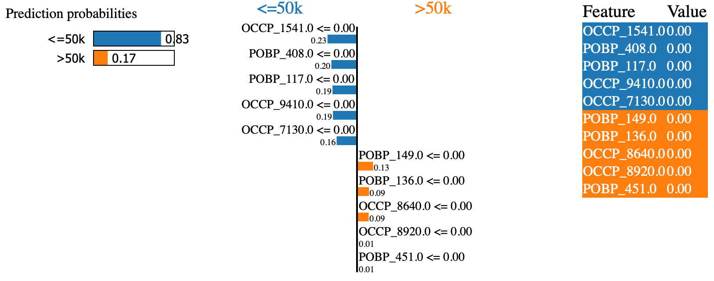
    
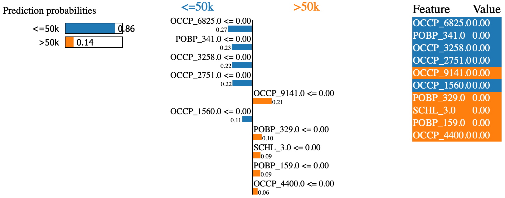
    
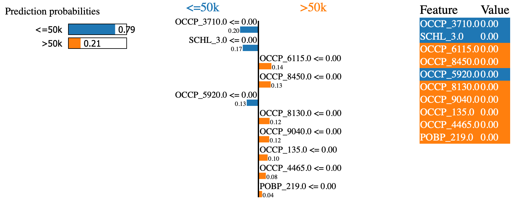


* Commentaires / analyses

La méthode Lime produit une explication locale (spécifique à l'exemple). Dans notre cas, nous avons mené l'expérimentation sur 3 exemples différents. 
Sur ces 3 exemples, on note des similarités. En effet, on constate que les features OCCP (Occupation Code) et POBP (Place of Birth) ont un fort poids sur la prédiction. Ils permettent de tirer la prédiction vers le bas ou vers le haut.


### Méthode SHAP

```python
import shap

shap.initjs()

shap_explainer = shap.TreeExplainer(model)
shap_values = shap_explainer(features_test)

for i in samples_indices:
    shap.plots.waterfall(shap_values[i])
```

* Résultats
    

    

    


* Commentaires / analyses

La méthode Shap nous fournit une explication plus marginal que Lime. En effet, les graphiques montrent comment la valeur de base (probabilité moyenne) est ajustée par chaque attribut. Sur nos 3 exemples, on constate généralement que les features ayant le plus gros impacts sur la prédiction finale (éloignement de la moyenne) sont WKHP (Horaires hebdomadaires sur les 12 derniers mois) et AGEP (Age).


### Comparaison LIME et SHAP

LIME est plus simple et rapide, mais il fait une approximation linéaire locale.

SHAP est plus robuste, théoriquement fondé, mais plus coûteux.

SHAP semblent globalement plus fiable.

### Analyse Summary plot de SHAP

#### Approfondissement 1: Global

```python
shap.plots.beeswarm(shap_values)
```
    
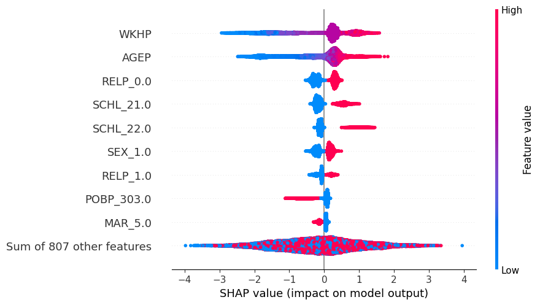
    
#### Approfondissement 2: Par sous-groupes

```python
labels_pred = model.predict(features_test)

y_pred = labels_pred.squeeze()
y_test = labels_test.squeeze()

TP = features_test[(y_pred==1) & (y_test==1)]
TN = features_test[(y_pred==0) & (y_test==0)]
FP = features_test[(y_pred==1) & (y_test==0)]
FN = features_test[(y_pred==0) & (y_test==1)]

for name, group in [("TP",TP),("TN",TN),("FP",FP),("FN",FN)]:
    print(name)
    if len(group) > 0:
        shap_values_group = shap_explainer(group)
        shap.plots.beeswarm(shap_values_group)
    else:
        print("Aucun exemple dans le groupe")
```

* TP
  
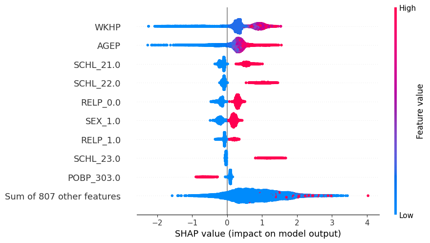
    
* TN
  
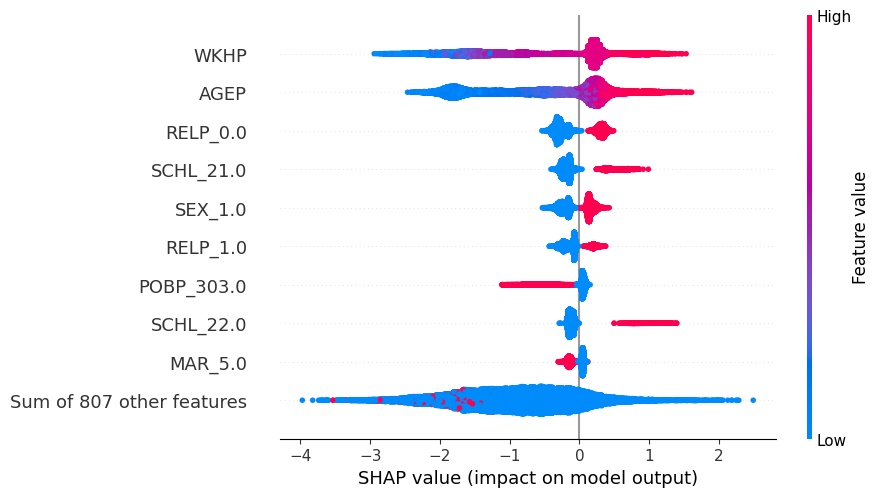

* FP
    
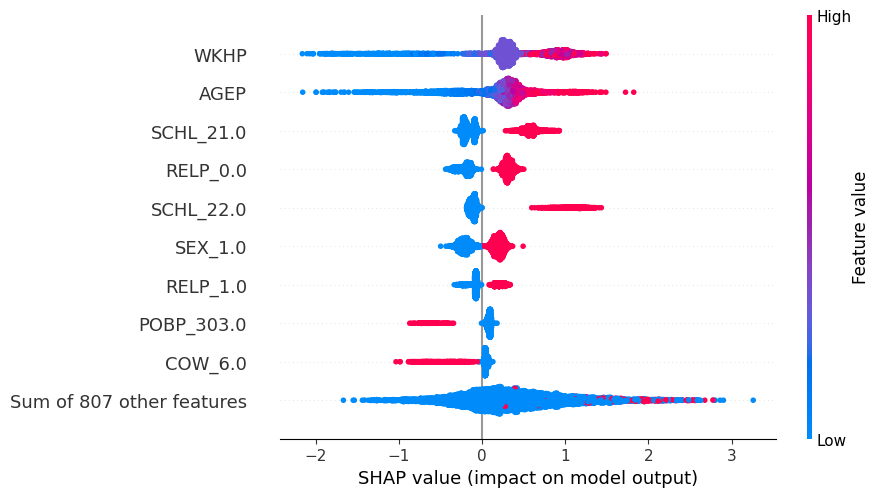

* FN

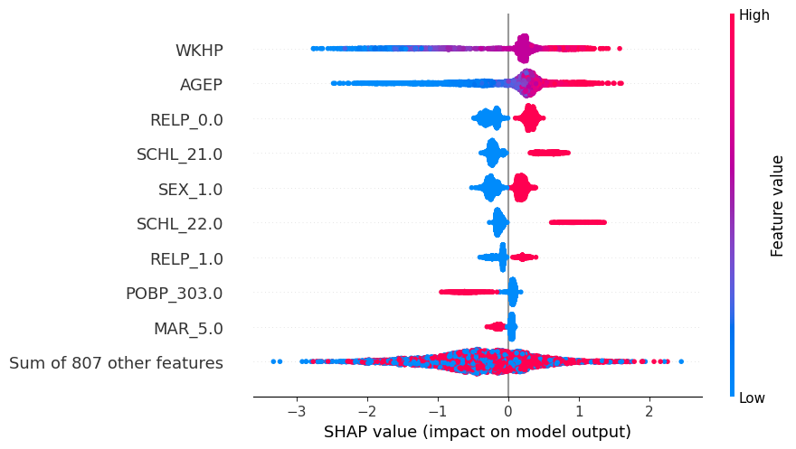

## Explicabilité : contrefactuelle

```python
i = samples_indices[-1]
example = features_test.iloc[i].copy()
prediction = model.predict([example])[0]

for feature in features_test.columns:
    example_copy = example.copy()
    initial_value = example_copy[feature]

    if set(features_test[feature].unique()) <= {0, 1}:
        example_copy[feature] = 1 - initial_value
    else:
        example_copy[feature] = example_copy[feature] + features_test[feature].std()

    prediction_copy = model.predict([example_copy])[0]
    
    if prediction_copy != prediction:
        print(f"Changement de prédiction ({prediction} -> {prediction_copy}) obtenu avec : {feature} ({initial_value} -> {example_copy[feature]})")
        break
```

Dans l'expérience que nous avons menée sur les 3 exemples précédents, nous avons permuté chacune des features avec la valeur opposé (dans le cas catégoriel) ou nous avons ajouté l'écart type (dans le cas continu). 
Pour 2 des exemples, nous avons réussi à déclencher un changement de prédiction. Ce changement à eu lieu la première fois sur permutation de la feature OCCP 2300 (Enseignant de maternelle et primaire) de 0 à 1 et la deuxième sur la feature OCCP 3602 (Aide soignant à domicile) de 0 à 1. Dans les 2 cas, la prédiction passe de "plus de \$50k" à "moins de \$50k".
